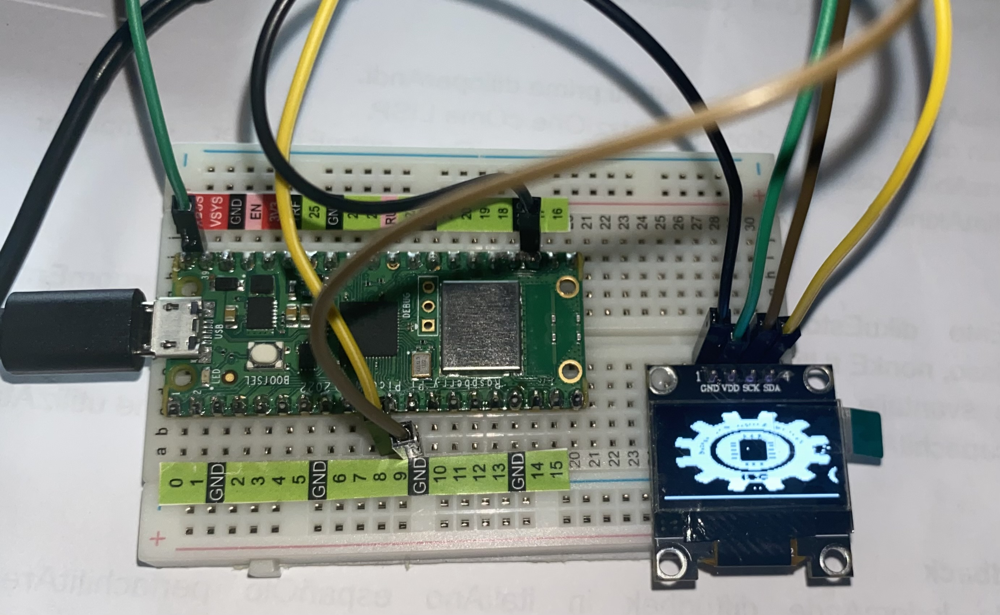

# Practica-2.1

### *2.1.1 Practica De inicio es la básico de Desplegar algo en pantalla, algunos quieren el logo de ISC, esta bien, otro texto simple, se agradece,  en el OLED DIsplay*

El ambiente en el que se realizó fue en Thonny con Micropython, haciendo uso de la Pico W.
_Lo primero que se realizó fue la programación del led blink, donde se prende y apaga el led de la Pico W_

**------------BLINK------------**

**Código**
```python
# Jiménez Rivera Paulina 20211796

# librerías importadas
from machine import Pin
from utime import sleep

#objeto led de la Pico W
led = machine.Pin("LED", machine.Pin.OUT)

#ciclo mientras para repetir proceso de parpadeo de led
while True:
    led.toggle()
    sleep(0.5) #tiempo de descanso
```

Led en estado inicial o apagado: | Led encendido:
---------------------------------|---------------------------------
              | 


_Después se realizó una segunda prueba desplegando el logo de la carrera (ISC) en la pantalla oled_

**------------LOGO ISC------------**

**Código**
```python
# #Jiménez Rivera Paulina 20211796

#librerías importadas
from machine import Pin, I2C
from ssd1306 import SSD1306_I2C
import framebuf, sys
import utime

# definir función para inicializar la oled
def init_i2c(scl_pin, sda_pin):
    
    # Inicializar componente I2C
    i2c_dev = I2C(1, scl=Pin(scl_pin), sda=Pin(sda_pin), freq=200000)
    i2c_addr = [hex(ii) for ii in i2c_dev.scan()] 
    
    #Condiciones
    if not i2c_addr:
        print('No I2C Display Found')
        sys.exit()
    else:
        print("I2C Address      : {}".format(i2c_addr[0]))
        print("I2C Configuration: {}".format(i2c_dev))
    return i2c_dev #variable que retorna

# objeto i2c donde se icnluyen las conexiones de los pines correspondientes a SDA y SCL
i2c = machine.I2C(0, sda=machine.Pin(8), scl=machine.Pin(9), freq=400000)

# Define las dimensiones -en pixels- de la pantalla
oled = SSD1306_I2C(128,64,i2c)

#matriz para desplegar el logo
imagen = [
0x00, 0x00, 0x00, 0x00, 0x00, 0x00, 0x00, 0x00, 0x00, 0x00, 0x00, 0x00, 0x00, 0x00, 0x00, 0x00, 
0x00, 0x00, 0x00, 0x00, 0x00, 0x00, 0x03, 0x80, 0x00, 0x0f, 0x00, 0x00, 0x00, 0x00, 0x00, 0x00, 
0x00, 0x00, 0x00, 0x00, 0x00, 0x01, 0xff, 0xc0, 0x00, 0x1f, 0xfc, 0x00, 0x00, 0x00, 0x00, 0x00, 
0x00, 0x00, 0x00, 0x00, 0x00, 0x03, 0xff, 0xc0, 0x00, 0x3f, 0xfe, 0x00, 0x00, 0x00, 0x00, 0x00, 
0x00, 0x00, 0x00, 0x00, 0x00, 0x01, 0xff, 0xe0, 0x00, 0x3f, 0xfc, 0x00, 0x00, 0x00, 0x00, 0x00, 
0x00, 0x00, 0x00, 0x00, 0x00, 0x01, 0xff, 0xe0, 0x00, 0x7f, 0xf8, 0x00, 0x00, 0x00, 0x00, 0x00, 
0x00, 0x00, 0x00, 0x00, 0x00, 0x01, 0xff, 0xf0, 0x00, 0x7f, 0xf8, 0x00, 0x00, 0x00, 0x00, 0x00, 
0x00, 0x00, 0x00, 0x00, 0x00, 0x00, 0xff, 0xff, 0xff, 0xff, 0xf8, 0x00, 0x00, 0x00, 0x00, 0x00, 
0x00, 0x00, 0x00, 0x1e, 0x00, 0x00, 0xff, 0xff, 0xff, 0xff, 0xf8, 0x00, 0x07, 0xe0, 0x00, 0x00,
0x00, 0x00, 0x00, 0x7f, 0x80, 0x03, 0xff, 0xff, 0xff, 0xff, 0xff, 0x00, 0x1f, 0xf8, 0x00, 0x00, 
0x00, 0x00, 0x00, 0xff, 0xe0, 0x1f, 0xff, 0xfe, 0xdb, 0x79, 0xff, 0xf0, 0xff, 0xfc, 0x00, 0x00, 
0x00, 0x00, 0x03, 0xff, 0xfc, 0xff, 0xff, 0xb7, 0x7f, 0xf3, 0xff, 0xff, 0xff, 0xfe, 0x00, 0x00, 
0x00, 0x00, 0x01, 0xff, 0xff, 0xfe, 0x1f, 0xff, 0xff, 0xff, 0xfd, 0xff, 0xff, 0xf8, 0x00, 0x00,
0x00, 0x00, 0x00, 0xff, 0xff, 0xff, 0xff, 0xff, 0xff, 0xff, 0xfc, 0x7f, 0xff, 0xe0, 0x00, 0x00, 
0x00, 0x00, 0x00, 0x3f, 0xff, 0xef, 0xff, 0x80, 0x00, 0x07, 0xff, 0xef, 0xff, 0x80, 0x00, 0x00, 
0x00, 0x00, 0x00, 0x0f, 0xff, 0xff, 0xf0, 0x00, 0x00, 0x00, 0x3f, 0xff, 0xff, 0x00, 0x00, 0x00, 
0x00, 0x00, 0x00, 0x07, 0xff, 0xbf, 0x80, 0x1f, 0xff, 0xf0, 0x07, 0xff, 0x7f, 0x00, 0x00, 0x00, 
0x00, 0x00, 0x00, 0x0f, 0xff, 0xfc, 0x03, 0xff, 0xff, 0xff, 0x00, 0xff, 0xff, 0x80, 0x00, 0x00, 
0x00, 0x00, 0x00, 0x1f, 0xff, 0xf0, 0x1f, 0xfb, 0xef, 0x3f, 0xe0, 0x3f, 0xdf, 0xe0, 0x00, 0x00, 
0x00, 0x00, 0x00, 0x3f, 0xff, 0xc0, 0x7f, 0xf9, 0xcf, 0x3f, 0xfc, 0x0f, 0xff, 0xf0, 0x00, 0x00, 
0x00, 0x0e, 0x00, 0x7f, 0x9f, 0x01, 0xff, 0xfb, 0xef, 0x7f, 0xff, 0x07, 0xff, 0xf8, 0xff, 0xc0, 
0x00, 0x1f, 0xfc, 0xff, 0xfe, 0x07, 0xff, 0xe0, 0x00, 0x1f, 0xff, 0x81, 0xf3, 0xff, 0xff, 0xe0, 
0x00, 0x1f, 0xff, 0xfe, 0x3c, 0x0f, 0xff, 0x80, 0x00, 0x07, 0xff, 0xc0, 0xff, 0xff, 0xff, 0xe0, 
0x00, 0x3f, 0xff, 0xff, 0xf8, 0x1f, 0xff, 0x80, 0x00, 0x03, 0xff, 0xe0, 0x7f, 0x7f, 0xff, 0xf0, 
0x00, 0x3f, 0xff, 0xf9, 0xf0, 0x3f, 0xe1, 0x80, 0x00, 0x02, 0x1f, 0xf0, 0x3e, 0xff, 0xff, 0xf0, 
0x00, 0x3f, 0xff, 0xff, 0xf0, 0x7f, 0xff, 0x80, 0x00, 0x03, 0xff, 0xf8, 0x3f, 0xff, 0xff, 0x80, 
0x00, 0x03, 0xff, 0xf5, 0xe0, 0x7f, 0xe1, 0x80, 0x00, 0x03, 0x1f, 0xfc, 0x1f, 0xff, 0xe0, 0x00, 
0x00, 0x00, 0x0f, 0xff, 0xe0, 0x7f, 0xff, 0x80, 0x00, 0x03, 0xff, 0xfc, 0x1f, 0xff, 0x00, 0xc0, 
0x00, 0x00, 0x07, 0xf9, 0xe0, 0xff, 0xff, 0x81, 0x00, 0x03, 0xff, 0xfc, 0x1f, 0xff, 0x00, 0x18, 
0x00, 0x00, 0x07, 0xff, 0xe0, 0xff, 0xe1, 0x80, 0x00, 0x02, 0x1f, 0xfc, 0x1f, 0xff, 0xc0, 0x00,
0x00, 0x00, 0x07, 0xf3, 0xe0, 0xff, 0xff, 0x80, 0x00, 0x03, 0xff, 0xfc, 0x1f, 0xff, 0x81, 0x80, 
0x00, 0x00, 0x07, 0xe5, 0xe0, 0xff, 0xff, 0x80, 0x00, 0x03, 0xff, 0xfc, 0x1f, 0xff, 0x80, 0x00, 
0x00, 0x00, 0x07, 0xff, 0xe0, 0x7f, 0xe0, 0x80, 0x00, 0x02, 0x0f, 0xfc, 0x1f, 0xff, 0x83, 0x00, 
0x00, 0x00, 0x07, 0xff, 0xe0, 0x7f, 0xff, 0x80, 0x00, 0x03, 0xff, 0xf8, 0x1f, 0xff, 0xf8, 0x00, 
0x00, 0x01, 0xff, 0xff, 0xf0, 0x3f, 0xff, 0x80, 0x00, 0x03, 0xff, 0xf8, 0x3f, 0xff, 0xff, 0xe0, 
0x00, 0x3f, 0xff, 0xff, 0xf0, 0x1f, 0xe1, 0x80, 0x00, 0x02, 0x0f, 0xf0, 0x3f, 0xff, 0xff, 0xf0, 
0x00, 0x3f, 0xff, 0xff, 0xf8, 0x0f, 0xff, 0x80, 0x00, 0x03, 0xff, 0xe0, 0x7f, 0xff, 0xff, 0xf0, 
0x00, 0x3f, 0xff, 0xff, 0xfc, 0x07, 0xff, 0xc0, 0x00, 0x07, 0xff, 0xc0, 0xff, 0xff, 0xff, 0xe0, 
0x00, 0x1f, 0xff, 0xff, 0xfe, 0x03, 0xff, 0xff, 0xff, 0xff, 0xff, 0x01, 0xff, 0xff, 0xff, 0xe0, 
0x00, 0x1f, 0xff, 0xff, 0xff, 0x00, 0xff, 0xf9, 0xcf, 0x3f, 0xfe, 0x07, 0xff, 0xf8, 0x0f, 0xc0, 
0x00, 0x0f, 0x00, 0x7f, 0xff, 0xc0, 0x3f, 0xf9, 0xcf, 0x3f, 0xf0, 0x0f, 0xff, 0xf0, 0x00, 0x00, 
0x00, 0x00, 0x00, 0x3f, 0xff, 0xf0, 0x07, 0xff, 0xff, 0xff, 0xc0, 0x3f, 0xff, 0xe0, 0x00, 0x00, 
0x00, 0x00, 0x00, 0x0f, 0xff, 0xfc, 0x00, 0xff, 0xff, 0xfc, 0x00, 0xff, 0xff, 0xc0, 0x00, 0x00, 
0x00, 0x00, 0x00, 0x07, 0xff, 0xff, 0x80, 0x01, 0xff, 0x00, 0x07, 0xff, 0xff, 0x80, 0x00, 0x01, 
0x00, 0x00, 0x00, 0x03, 0xff, 0xff, 0xf0, 0x00, 0x00, 0x00, 0x3f, 0xff, 0xff, 0xc0, 0x00, 0x07, 
0x00, 0x00, 0x00, 0x07, 0xff, 0xff, 0xff, 0x80, 0x00, 0x07, 0xff, 0xff, 0xff, 0xe0, 0x00, 0x0e, 
0x00, 0x00, 0x00, 0x1f, 0xff, 0xff, 0xff, 0xff, 0xff, 0xff, 0xff, 0xff, 0xff, 0xf8, 0x00, 0x1c,
0x00, 0x00, 0x00, 0x7f, 0xff, 0xff, 0xff, 0xcc, 0x1e, 0x0f, 0xff, 0xff, 0xff, 0xfc, 0x00, 0x1c, 
0x00, 0x00, 0x01, 0xff, 0xff, 0xff, 0xff, 0x88, 0x0c, 0x07, 0xff, 0xff, 0xff, 0xff, 0x00, 0x3c, 
0x00, 0x00, 0x01, 0xff, 0xfc, 0x7f, 0xff, 0x8c, 0x00, 0xff, 0xff, 0xf0, 0x3f, 0xfe, 0x00, 0x1c, 
0x00, 0x00, 0x00, 0xff, 0xf0, 0x07, 0xff, 0x88, 0x04, 0x07, 0xff, 0x80, 0x0f, 0xf8, 0x00, 0x1c, 
0x00, 0x00, 0x00, 0x3f, 0xc0, 0x00, 0xff, 0xce, 0x1f, 0x1f, 0xfc, 0x00, 0x03, 0xe0, 0x00, 0x0e, 
0x00, 0x00, 0x00, 0x07, 0x00, 0x00, 0x7f, 0xff, 0xff, 0xff, 0xfc, 0x00, 0x00, 0x00, 0x00, 0x07,
0x00, 0x00, 0x00, 0x00, 0x00, 0x00, 0x7f, 0xfc, 0x00, 0x7f, 0xfc, 0x00, 0x00, 0x00, 0x00, 0x01, 
0x00, 0x00, 0x00, 0x00, 0x00, 0x00, 0xff, 0xf8, 0x00, 0x3f, 0xfc, 0x00, 0x00, 0x00, 0x00, 0x00, 
0x00, 0x00, 0x00, 0x00, 0x00, 0x00, 0xff, 0xf0, 0x00, 0x1f, 0xfe, 0x00, 0x00, 0x00, 0x00, 0x00, 
0x00, 0x00, 0x00, 0x00, 0x00, 0x01, 0xff, 0xe0, 0x00, 0x1f, 0xff, 0x00, 0x00, 0x00, 0x00, 0x00, 
0x00, 0x00, 0x00, 0x00, 0x00, 0x01, 0xff, 0xe0, 0x22, 0x0f, 0xfe, 0x00, 0x00, 0x00, 0x00, 0x00, 
0x00, 0x00, 0x00, 0x00, 0x00, 0x00, 0x1f, 0xc0, 0x00, 0x07, 0xc0, 0x00, 0x00, 0x00, 0x00, 0x00, 
0x00, 0x00, 0x00, 0x00, 0x00, 0x00, 0x00, 0x00, 0x00, 0x00, 0x00, 0x00, 0x00, 0x00, 0x00, 0x00, 
0x00, 0x00, 0x00, 0x00, 0x00, 0x00, 0x00, 0x00, 0x00, 0x00, 0x00, 0x00, 0x00, 0x00, 0x00, 0x00, 
0x00, 0x00, 0x00, 0x00, 0x00, 0x00, 0x00, 0x00, 0x00, 0x00, 0x00, 0x00, 0x00, 0x00, 0x00, 0x00, 
0x00, 0x00, 0x00, 0x00, 0x00, 0x00, 0x00, 0x00, 0x00, 0x00, 0x00, 0x00, 0x00, 0x00, 0x00, 0x00, 
0xff, 0xff, 0xff, 0xff, 0xff, 0xff, 0xff, 0xff, 0xff, 0xff, 0xff, 0xff, 0xff, 0xff, 0xff, 0xff
]

#objeto para desplegar la imagen por medio de "bytearray"
logo = framebuf.FrameBuffer(bytearray(imagen),128,64,framebuf.MONO_HLSB)

oled.fill(0) #limpia la pantalla oled
oled.blit(logo,0,0) # logo y punto de inicio de representación
oled.show() # Muestra el resultado
```
Despliegue de Logo en oled
 

_Finalmente se realizó una tercer prueba desplegando un "Hola mundo :)" en la pantalla oled_

**------------HOLA MUNDO------------**

**Código**
```python
# #Jiménez Rivera Paulina 20211796

#librerías importadas
import machine
import ssd1306

# Configuración de pines SDA y SCL para la comunicación I2C
i2c = machine.I2C(0, sda=machine.Pin(8), scl=machine.Pin(9))

# Configura el objeto SSD1306 para visualización en pantalla OLED
oled = ssd1306.SSD1306_I2C(128, 64, i2c)

# Limpia la pantalla
oled.fill(0)

# Escribe "Hola Mundo" en la pantalla OLED
oled.text("Hola Mundo :)", 0, 0)

oled.show() # Muestra el resultado (texto) en pantalla
```
Despliegue de "Hola mundo :)" en oled
 

### *2.1.2 Desplegar la hora de Internet en la Pico usando su Wifi integrada para que interrogue un servidor NTP Time Server, en el OLED DIsplay*
**Código**

```python
# #Jiménez Rivera Paulina 20211796

#librerías importadas
import utime
import network
from machine import Pin, I2C #configuración de pines para su comunicación
from ssd1306 import SSD1306_I2C #comunicación con la pantalla OLED
import framebuf, sys

#bloque de código para la conexion del raspberry a internet
print("¡Conectando a Wi-Fi! ", end="")
wlan = network.WLAN(network.STA_IF)
wlan.active(True)

# Red wifi con su nombre y contraseña (en este caso se utilizó los datos del teléfono)
wlan.connect("PJ","19yfnefr20vrm")

# Ciclo
while not wlan.isconnected():
  print(".", end="")
  time.sleep(0.1) # tiempo de espera
  
print("¡Conexión con éxito!")
print(wlan.ifconfig())

#Verificación de dispositivo con una función
def init_i2c(scl_pin, sda_pin):
    i2c_dev = I2C(1, scl=Pin(scl_pin), sda=Pin(sda_pin), freq=200000)
    i2c_addr = [hex(ii) for ii in i2c_dev.scan()]
    
    #Condiciones
    if not i2c_addr:
        print('Pantalla I2C no encontrada')
        sys.exit()
    else:
        print("I2C Address : {}".format(i2c_addr[0]))
        print("I2C Configuration: {}".format(i2c_dev))
        
    return i2c_dev #variable que retorna

# sda y scl con los pines correspondientes que estén conectados
i2c = machine.I2C(0, sda=machine.Pin(8), scl=machine.Pin(9), freq=400000)
oled = ssd1306.SSD1306_I2C(128, 64, i2c)

import ntptime #importar librería Network Time Protocol (NTP)
ntptime.settime() # sincroniza la hora local

while True: 
    hr = utime.localtime() #hora local
    
    #Despliegue de hora de internet con el formato correspondiente
    print("{:02}:{:02}:{:02}".format(hr[3], hr[4], hr[5]))
    utime.sleep(1) #espera
    oled.fill(0) #limpia la pantalla oled
    
    oled.text("Hora local:", 0, 0)
    oled.text("{:02d}:{:02d}:{:02d}".format(hr[3], hr[4], hr[5]), 0, 16)
    oled.show() # Muestra el resultado
    time.sleep(1)
```
Despliegue de hora local en oled usando wifi
 
