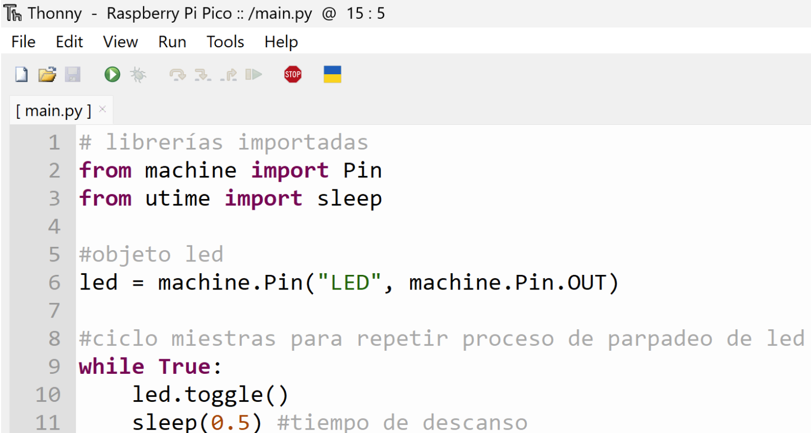

# Practica-2.1

### *2.1.1 Practica De inicio es la básico de Desplegar algo en pantalla, algunos quieren el logo de ISC, esta bien, otro texto simple, se agradece,  en el OLED DIsplay*

Lo primero que se realizó fue la programación del led blink, donde se prende y apaga el led de la Pico W

**Código**
```python
# librerías importadas
from machine import Pin
from utime import sleep

#objeto led
led = machine.Pin("LED", machine.Pin.OUT)

#ciclo miestras para repetir proceso de parpadeo de led
while True:
    led.toggle()
    sleep(0.5) #tiempo de descanso
```



### *2.1.2 Desplegar la hora de Internet en la Pico usando su Wifi integrada para que interrogue un servidor NTP Time Server, en el OLED DIsplay*
**Código**
