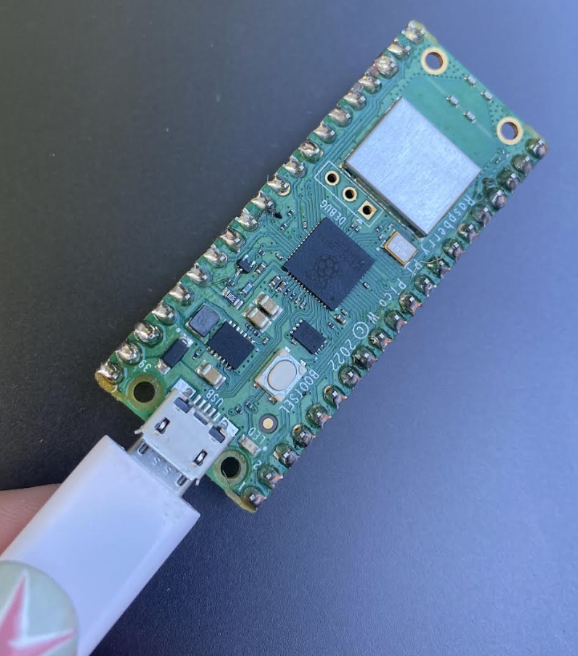

# Practica-2.1

### *2.1.1 Practica De inicio es la básico de Desplegar algo en pantalla, algunos quieren el logo de ISC, esta bien, otro texto simple, se agradece,  en el OLED DIsplay*

El ambiente en el que se realizó fue en Thonny con Micropython, haciendo uso de la Pico W,, un protoboard.
Lo primero que se realizó fue la programación del led blink, donde se prende y apaga el led de la Pico W

**Código**
```python
# Jiménez Rivera Paulina 20211796

# librerías importadas
from machine import Pin
from utime import sleep

#objeto led de la Pico W
led = machine.Pin("LED", machine.Pin.OUT)

#ciclo mientras para repetir proceso de parpadeo de led
while True:
    led.toggle()
    sleep(0.5) #tiempo de descanso
```

Despliegue de Led en estado inicial o apagado:


Despliegue de Led prendido:


### *2.1.2 Desplegar la hora de Internet en la Pico usando su Wifi integrada para que interrogue un servidor NTP Time Server, en el OLED DIsplay*
**Código**
